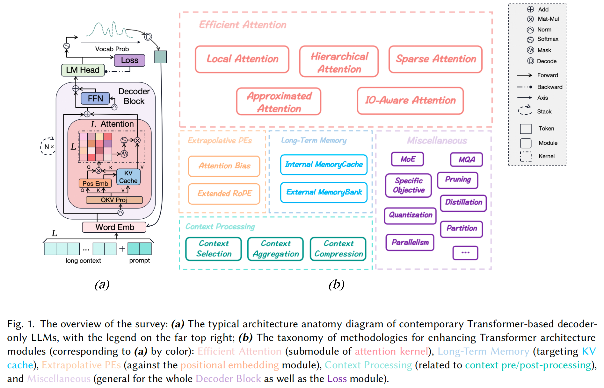

# long-llms-learning

<p align="left">
<a href="https://arxiv.org/abs/2311.12351v2">

</a>
</p>

A repository sharing the panorama of the methodology literature on Transformer **architecture** upgrades in Large Language Models for handling **extensive context windows**, with real-time updating the newest published works.


## Overview

### Survey

For a clear taxonomy and more insights about the methodology, you can refer to our **survey**: [Advancing Transformer Architecture in Long-Context Large Language Models: A Comprehensive Survey](https://arxiv.org/abs/2311.12351v2) with a overview shown below




### Flash-ReRoPE

We have augmented the great work [rerope](https://github.com/bojone/rerope) by Su with flash-attn kernel to combine rerope's infinite postional extrapolation capability with flash-attn's efficience, named as **flash-rerope**.

You can find and use the implementation as a flash-attn-like interface function [here](./notebooks/flash_rerope.py), with a simple precision and flops test script [here](./notebooks/test_flash_rerope.py).

Or you can further see how to implement llama attention module with flash-rerope [here](https://github.com/Strivin0311/long-llms-eval/blob/main/evals/aug.py#L809).

## Latest News

### Latest Works

* [2024.02.15] [Data Engineering for Scaling Language Models to 128K Context](https://arxiv.org/abs/2402.10171), located [here](./methodology/miscellaneous.md#long-contenxt-training) in this repo.
  
* [2024.01.15] [Lightning Attention-2: A Free Lunch for Handling Unlimited Sequence Lengths in Large Language Models](https://arxiv.org/abs/2401.04658), located [here](./methodology/efficient_attn_sec/ioaware_attn.md#lightning-attention) in this repo.


### Latest Baselines

* [2024.01.30] [chatglm-6b-128k](https://huggingface.co/THUDM/chatglm3-6b-128k) with $L_{max}$ **128k**, located [here](./evaluation/baselines.md#baseline-table) in this repo.
* [2024.01.25] [gpt-4-turbo-preview](https://platform.openai.com/docs/models/gpt-4-and-gpt-4-turbo) with $L_{max}$ **128k**, located [here](./evaluation/baselines.md#baseline-table) in this repo.


### Latest Benchmarks

* [2023.12.19] [InfiniteBench](https://github.com/OpenBMB/InfiniteBench), located [here](./evaluation/datasets.md#dataset-table) in this repo.
* [2023.08.29] [LongBench](https://github.com/THUDM/LongBench), located [here](./evaluation/datasets.md#dataset-table) in this repo.


## More to Learn

### Long-LLMs-Evals

* We've also released a building repo [long-llms-evals](https://github.com/Strivin0311/long-llms-evals) as a pipeline to evaluate various methods designed for general / specific LLMs to enhance their long-context capabilities on well-known long-context benchmarks.

### LLMs-Learning

* This repo is also a sub-track for another repo [llms-learning](https://github.com/Strivin0311/llms-learning), where you can learn more technologies and applicated tasks about the full-stack of Large Language Models.


## Table of Contents

* [Methodology](./methodology/)
  * [Efficient Attention](./methodology/efficient_attn.md)
    * [Local Attention](./methodology/efficient_attn_sec/local_attn.md)
    * [Sparse Attention](./methodology/efficient_attn_sec/sparse_attn.md)
    * [Hierarchical Attention](./methodology/efficient_attn_sec/hierarchical_attn.md)
    * [Approximated Attention](./methodology/efficient_attn_sec/approx_attn.md)
    * [IO-Aware Attention](./methodology/efficient_attn_sec/ioaware_attn.md)
  * [Long-Term Memory](./methodology/long-term_memory.md)
    * [Internal MemoryCache](./methodology/long-term_memory_sec/internal_memory_cache.md)
    * [External MemoryBank](./methodology/long-term_memory_sec/external_memory_bank.md)
  * [Extrapolative PEs](./methodology/extrapolative_pes.md)
    * [Attention Bias](./methodology/extrapolative_pes_sec/attention_bias.md)
    * [Extended RoPE](./methodology/extrapolative_pes_sec/extended_rope.md)
  * [Context Processing](./methodology/context_process.md)
    * [Context Selection](./methodology/context_process_sec/context_selection.md)
    * [Context Aggregation](./methodology/context_process_sec/context_aggregation.md)
    * [Context Compression](./methodology/context_process_sec/context_compression.md)
  * [Miscellaneous](./methodology/miscellaneous.md)
    * [Specific Objectives](./methodology/miscellaneous_sec/spec_objective.md)
    * [Specific Activation Functions](./methodology/miscellaneous_sec/spec_activation.md)
    * [Mixture of Experts](./methodology/miscellaneous_sec/moe.md)
    * [Parallelism](./methodology/miscellaneous_sec/parallel.md)
    * [Weight Compression](./methodology/miscellaneous_sec/weight_compress.md)
    * [Long-contenxt Training](./methodology/miscellaneous.md#long-contenxt-training)
* [Evaluation](./evaluation/)
  * [Datasets](./evaluation/datasets.md)
  * [Metrics](./evaluation/metrics.md)
  * [Baselines](./evaluation/baselines.md)
* [Tookits](./toolkits/README.md)
* [Empirical Study & Survey](./empirical.md)


## Contribution

If you want to make contribution to this repo, you can just make a pr / email us with the link to the paper(s) or use the format as below:

* (un)read paper format:
```
#### <paper title> [(UN)READ]

paper link: [here](<link address>)

xxx link: [here](<link address>)

citation:
<bibtex citation>
```


## Citation

If you find the survey or this repo helpful in your research or work, you can cite our paper as below:

```bibtex
@misc{huang2024advancing,
      title={Advancing Transformer Architecture in Long-Context Large Language Models: A Comprehensive Survey}, 
      author={Yunpeng Huang and Jingwei Xu and Junyu Lai and Zixu Jiang and Taolue Chen and Zenan Li and Yuan Yao and Xiaoxing Ma and Lijuan Yang and Hao Chen and Shupeng Li and Penghao Zhao},
      year={2024},
      eprint={2311.12351},
      archivePrefix={arXiv},
      primaryClass={cs.CL}
}
```
