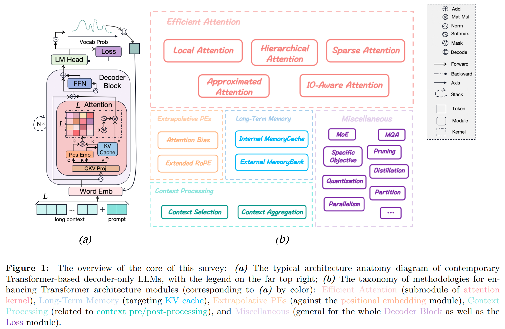

# long-llms-learning

<p align="left">
<a href="https://arxiv.org/abs/2311.12351">

</a>
</p>

A repository sharing the panorama of the methodology literature on Transformer **architecture** upgrades in Large Language Models for handling **extensive context windows**, with real-time updating the newest published works.

(*Note: this repo is still in its initial stage and keeping construction with the paper*)


## Overview of Survey

For a clear taxonomy and more insights about the methodology, you can refer to our **survey**: [Advancing Transformer Architecture in Long-Context Large Language Models: A Comprehensive Survey](https://arxiv.org/abs/2311.12351) with a overview shown below

(*Note: this is currently the draft version, with a few more work to do about some writing and the appendix*)





## More to Learn
* This repo is also a sub-track for my [llms-learning](https://github.com/Strivin0311/llms-learning) repo, where you can learn more technologies and applicated tasks about the full-stack of Large Language Models.


## Table of Contents

* [Methodology](./methodology/)
  * [Efficient Attention](./methodology/efficient_attn.md)
  * [Long-Term Memory](./methodology/long-term_memory.md)
  * [Extrapolative PEs](./methodology/extrapolative_pes.md)
  * [Context Processing](./methodology/context_process.md)
* [Benchmark](./benchmark/)


## Contribution


## Citation

If you find the survey or this repo helpful in your research or work, you can cite our paper as below:

```bibtex
@misc{huang2023advancing,
      title={Advancing Transformer Architecture in Long-Context Large Language Models: A Comprehensive Survey}, 
      author={Yunpeng Huang and Jingwei Xu and Zixu Jiang and Junyu Lai and Zenan Li and Yuan Yao and Taolue Chen and Lijuan Yang and Zhou Xin and Xiaoxing Ma},
      year={2023},
      eprint={2311.12351},
      archivePrefix={arXiv},
      primaryClass={cs.CL}
}
```
