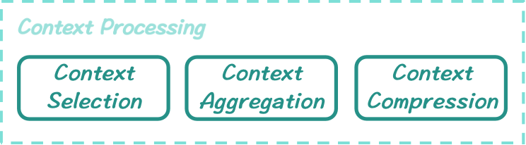

# Context Processing
*Here're some resources about Context Processing*

    </img>
    

        <strong>Taxonomy of Context Processing</strong>
    

### Intro

Many methods propose intricate designs around the attention module in the Transformer architecture. In contrast, there exist simpler approaches that treat pretrained LLMs as black-box or gray-box models and handle long-context inputs by making multiple calls to the model, ensuring that each call respects the 𝐿𝑚𝑎𝑥 limitation. While these approaches don’t enhance the LLMs’ inherent ability to process long contexts, they leverage the models’ in-context learning capabilities, albeit with increased computation and potentially less precise answers.

### Table of Contents
* [Intro](#intro)
* [Context Selection](./context_process_sec/context_selection.md)
* [Context Aggregation](./context_process_sec/context_aggregation.md)
* [Context Compression](./context_process_sec/context_compression.md)