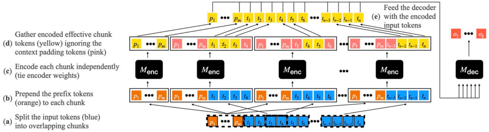
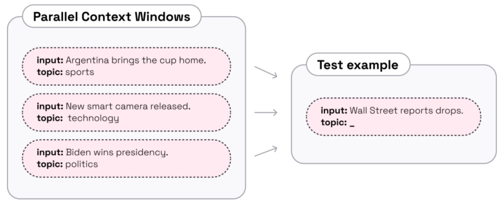
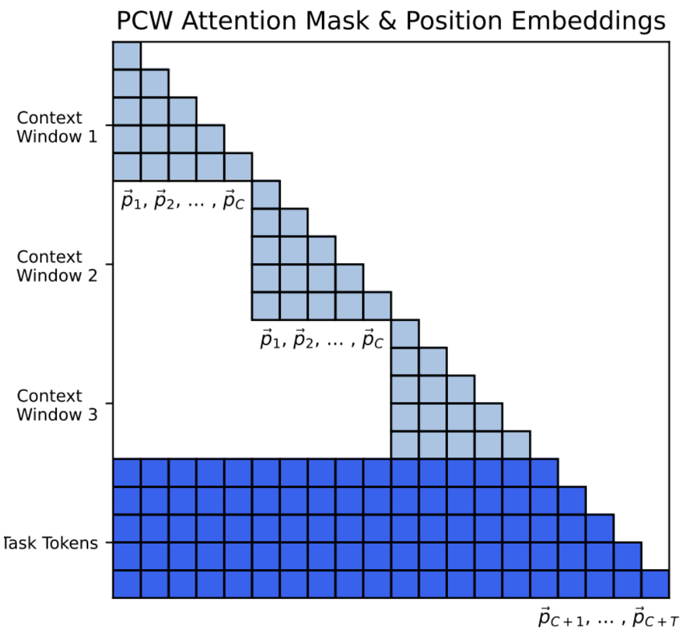

# Context Aggregation
*Here're some resources about Context Aggregation*


### Intro

In contrast to [selection-based methods](./context_selection.md), some approaches consider contributions from all context segments to the final answer rather than selecting one. Initially, they extract relevant information from each segment individually and then employ various fusion strategies to aggregate the retrieved information, arriving at the final answer. These approaches vary in two key aspects: how information is extracted from each segment and the fusion strategies used to integrate information across all segments.


### Table of Contents
* [Intro](#intro)
* [Fusion in Decoder](#fusion-in-decoder-fid)
* [Map Reduce and Refinement](#map-reduce-and-refinement)
* [Parallel Context Windows](#parallel-context-windows)


### Fusion in Decoder (FiD)


#### Efficient long-text understanding with short-text models (SLED) [`READ`]

<p align="center">
  </img>
</p>

paper link: [here](https://direct.mit.edu/tacl/article/doi/10.1162/tacl_a_00547/115346)

citation:

```bibtex
@article{ivgi2023efficient,
  title={Efficient long-text understanding with short-text models},
  author={Ivgi, Maor and Shaham, Uri and Berant, Jonathan},
  journal={Transactions of the Association for Computational Linguistics},
  volume={11},
  pages={284--299},
  year={2023},
  publisher={MIT Press}
}
```


#### Leveraging passage retrieval with generative models for open domain question answering (FiD) [`READ`]

paper link: [here](https://arxiv.org/pdf/2007.01282)

citation:

```bibtex
@article{izacard2020leveraging,
  title={Leveraging passage retrieval with generative models for open domain question answering},
  author={Izacard, Gautier and Grave, Edouard},
  journal={arXiv preprint arXiv:2007.01282},
  year={2020}
}
```


### Map Reduce and Refinement


#### LangChain: Building applications with LLMs through composability [`READ`]

github link: [here](https://github.com/langchain-ai/langchain)

doc link: [here](https://python.langchain.com/docs/get_started/introduction)

tutorial links:

|tutorial name|public date|main-lib version|notebook link|
|-|-|-|-|
|tutorial_langchain|2023.12|langchain=0.0.352, openai=1.6.1|[here](../notebooks/tutorial_langchain.ipynb)|


citation:
```bibtex
@misc{langchain2022,
    author = "Chase, Harrison",
    month = "10",
    title = "LangChain",
    howpublished = "\url{https://github.com/langchain-ai/langchain}",
    year = "2022"
}
```


### Parallel Context Windows


#### NBCE: Handling Length in Context Expansion of LLM with Naive Bayes [`READ`]

$$
\begin{align}
&\log \mathrm{P}(T|C_1,\ldots ,C_n) \xlongequal[NB]{} \log \left[ \frac{\mathrm{P}(T)\prod\limits_{i=1}^n \frac{\mathrm{P}(T|C_i)\mathrm{P}(C_i)}{\mathrm{P}(T)}}{\mathrm{P}(C_1,\ldots,C_n)} \right] = \sum\limits_{i=1}^n \log \mathrm{P}(T|C_i) - (n-1) \log \mathrm{P}(T) + const\\
        & \Rightarrow (\mu+1) \mathrm{pool}[\log \mathrm{P}(T|C_i)] - \mu \log \mathrm{P}(T) + const
\end{align}
$$

blog link: [here](https://spaces.ac.cn/archives/9617)

citation:

```bibtex
@misc{nbce,
    author = "Su, Jianlin",
    title = "NBCE: Handling Length in Context Expansion of LLM with Naive Bayes",
    year = "2023",
    month = "May",
    howpublished = "\url{https://spaces.ac.cn/archives/9617}"
}
```


#### Parallel context windows improve in-context learning of large language models [`READ`]

<p align="center">
  </img>
  </img>
</p>

paper link: [here](https://arxiv.org/pdf/2212.10947)

citation:

```bibtex
@article{ratner2022parallel,
  title={Parallel context windows improve in-context learning of large language models},
  author={Ratner, Nir and Levine, Yoav and Belinkov, Yonatan and Ram, Ori and Abend, Omri and Karpas, Ehud and Shashua, Amnon and Leyton-Brown, Kevin and Shoham, Yoav},
  journal={arXiv preprint arXiv:2212.10947},
  year={2022}
}
```


#### Structured prompting: Scaling in-context learning to 1,000 examples [`READ`]

paper link: [here](https://arxiv.org/pdf/2212.06713)

citation:
```bibtex
@article{hao2022structured,
  title={Structured prompting: Scaling in-context learning to 1,000 examples},
  author={Hao, Yaru and Sun, Yutao and Dong, Li and Han, Zhixiong and Gu, Yuxian and Wei, Furu},
  journal={arXiv preprint arXiv:2212.06713},
  year={2022}
}
```