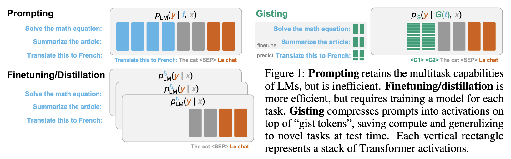
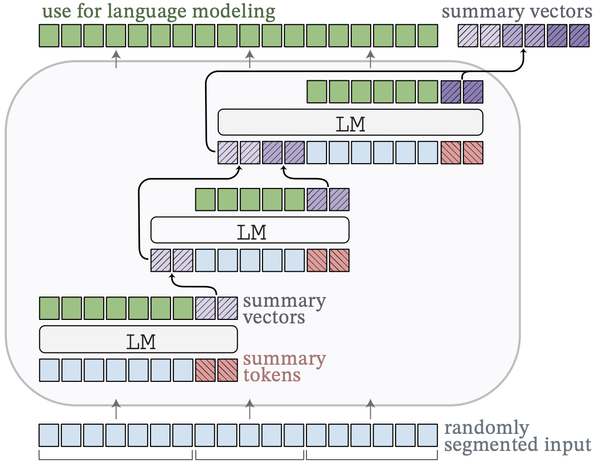
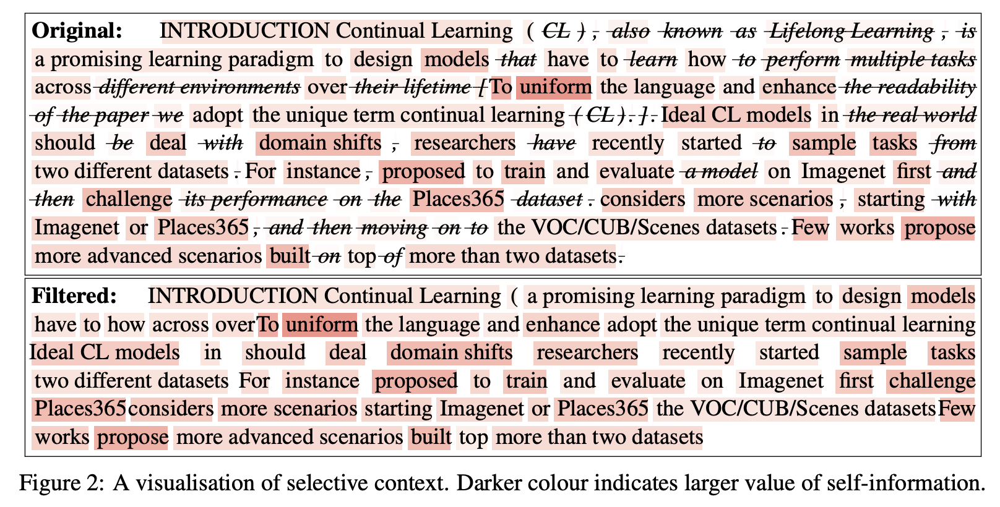
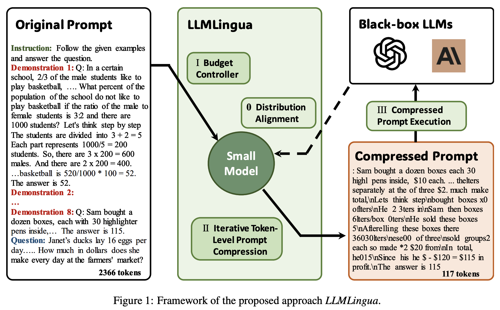

# Context Compression
*Here're some resources about Context Compression*


### Intro

Despite the [selection](./context_selection.md) or [aggregation](./context_aggregation.md) of source long contexts, some works focus on directly compressing the (hidden)
sequence length under the $L_{max}$ constraint. They aim to produce more condensed and abstract representations of the long raw contexts before feeding them into LLMs, through either learning embedded alternatives ([soft compression](#soft-compression)) or filtering out redundancies ([hard compression](#hard-compression)) based on various scores computed by pretrained models.


### Table of Contents

* [Intro](#intro)
* [Soft Compression](#soft-compression)
* [Hard Compression](#hard-compression)


### Soft Compression

#### Learning to compress prompts with gist token [`READ`]

<p align="center">
  </img>
</p>

paper link: [here](https://proceedings.neurips.cc/paper_files/paper/2023/file/3d77c6dcc7f143aa2154e7f4d5e22d68-Paper-Conference.pdf)

citation:

```bibtex
@article{mu2024learning,
  title={Learning to compress prompts with gist tokens},
  author={Mu, Jesse and Li, Xiang and Goodman, Noah},
  journal={Advances in Neural Information Processing Systems},
  volume={36},
  year={2024}
}
```


#### Adapting Language Models to Compress Contexts (AutoCompressor) [`READ`]

<p align="center">
  </img>
</p>

paper link: [here](https://arxiv.org/pdf/2305.14788)

citation:

```bibtex
@article{chevalier2023adapting,
  title={Adapting Language Models to Compress Contexts},
  author={Chevalier, Alexis and Wettig, Alexander and Ajith, Anirudh and Chen, Danqi},
  journal={arXiv preprint arXiv:2305.14788},
  year={2023}
}
```


#### Prompt Compression and Contrastive Conditioning for Controllability and Toxicity Reduction in Language Models [`READ`]

paper link: [here](https://arxiv.org/pdf/2210.03162.pdf)

citation:

```bibtex
@misc{wingate2022prompt,
      title={Prompt Compression and Contrastive Conditioning for Controllability and Toxicity Reduction in Language Models}, 
      author={David Wingate and Mohammad Shoeybi and Taylor Sorensen},
      year={2022},
      eprint={2210.03162},
      archivePrefix={arXiv},
      primaryClass={cs.CL}
}
```


### Hard Compression


#### Extending Context Window of Large Language Models via Semantic Compression [`READ`]

paper link: [here](https://arxiv.org/pdf/2312.09571.pdf)

citation:

```bibtex
@article{fei2023extending,
  title={Extending Context Window of Large Language Models via Semantic Compression},
  author={Fei, Weizhi and Niu, Xueyan and Zhou, Pingyi and Hou, Lu and Bai, Bo and Deng, Lei and Han, Wei},
  journal={arXiv preprint arXiv:2312.09571},
  year={2023}
}
```


#### Compressing context to enhance inference efficiency of large language models [`READ`]

<p align="center">
  </img>
</p>

paper link: [here](https://arxiv.org/pdf/2310.06201)

citation:

```bibtex
@article{li2023compressing,
  title={Compressing context to enhance inference efficiency of large language models},
  author={Li, Yucheng and Dong, Bo and Lin, Chenghua and Guerin, Frank},
  journal={arXiv preprint arXiv:2310.06201},
  year={2023}
}
```


#### Llmlingua: Compressing prompts for accelerated inference of large language models [`READ`]

<p align="center">
  </img>
</p>

paper link: [here](https://arxiv.org/pdf/2310.05736v2.pdf)

citation:

```bibtex
@article{jiang2023llmlingua,
  title={Llmlingua: Compressing prompts for accelerated inference of large language models},
  author={Jiang, Huiqiang and Wu, Qianhui and Lin, Chin-Yew and Yang, Yuqing and Qiu, Lili},
  journal={arXiv preprint arXiv:2310.05736},
  year={2023}
}
```