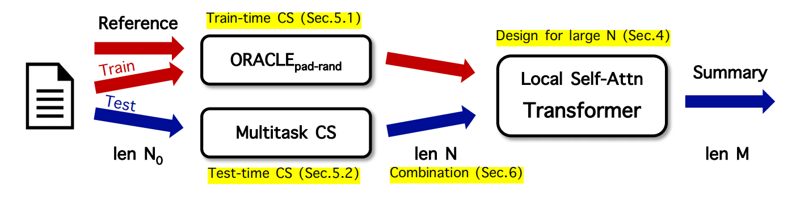
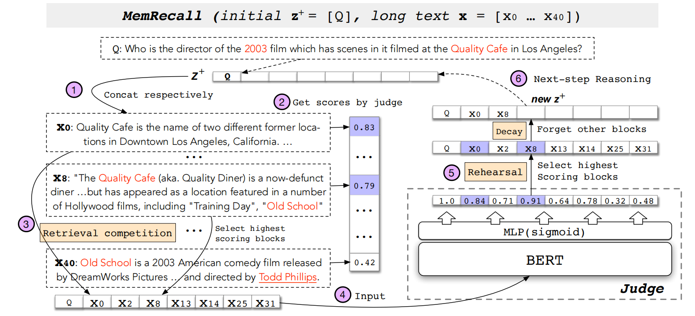

# Context Selection
*Here're some resources about Context Selection*


### Intro

To fit long segments within the context window of LLMs while preserving relevant information, some works partition
lengthy texts into segments and select specific ones based on predefined criteria. They vary in defining **selection criteria** with corresponding scores, either sorting simultaneously or picking iteratively.


#### LangChain: Building applications with LLMs through composability [`READ`]

github link: [here](https://github.com/langchain-ai/langchain)

doc link: [here](https://python.langchain.com/docs/get_started/introduction)

tutorial links:

|tutorial name|public date|main-lib version|notebook link|
|-|-|-|-|
|tutorial_langchain|2023.12|langchain=0.0.352, openai=1.6.1|[here](../notebooks/tutorial_langchain.ipynb)|


citation:

```bibtex
@misc{langchain2022,
    author = "Chase, Harrison",
    month = "10",
    title = "LangChain",
    howpublished = "\url{https://github.com/langchain-ai/langchain}",
    year = "2022"
}
```

#### Long-span summarization via local attention and content selection (LoBART) [`READ`]

<p align="center">
  </img>
</p>

paper link: [here](https://arxiv.org/pdf/2105.03801)

citation:

```bibtex
@article{manakul2021long,
  title={Long-span summarization via local attention and content selection},
  author={Manakul, Potsawee and Gales, Mark JF},
  journal={arXiv preprint arXiv:2105.03801},
  year={2021}
}
```


#### Cogltx: Applying bert to long texts (MemRecall) [`READ`]

<p align="center">
  </img>
</p>

paper link: [here](https://proceedings.neurips.cc/paper/2020/file/96671501524948bc3937b4b30d0e57b9-Paper.pdf)

citation:

```bibtex
@article{ding2020cogltx,
  title={Cogltx: Applying bert to long texts},
  author={Ding, Ming and Zhou, Chang and Yang, Hongxia and Tang, Jie},
  journal={Advances in Neural Information Processing Systems},
  volume={33},
  pages={12792--12804},
  year={2020}
}
```