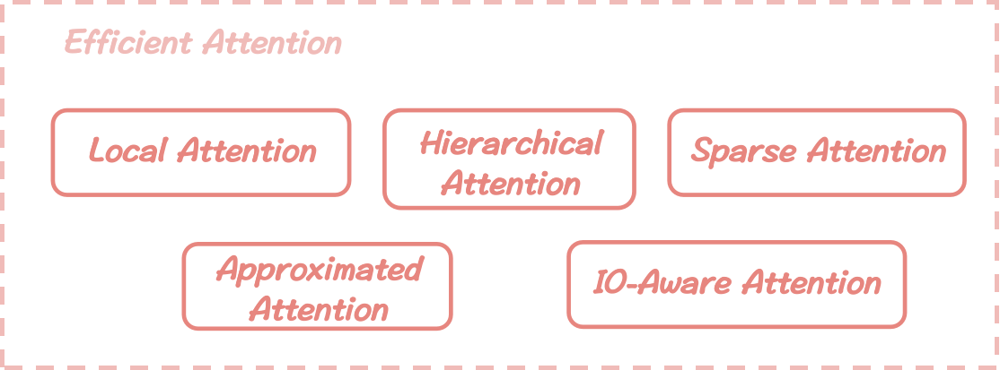

# Efficient Attention
*Here're some resources about Efficient Attention*

<p align="center">
    </img>
    <strong>Taxonomy of Efficient Attention</strong>
    
</p>

## Intro

This section shares the literatures dedicated to optimizing attention mechanisms, especially focusing on the kernel operations that make the module the computational bottleneck of the Transformer.

This approach enables the expansion of the effective context length boundary for LLMs during inference by directly increasing the hyperparameter $L_{max}$ (*maximum number of tokens in one sample*) in the pre-training stage. We further categorize these methods into five distinct strategies as above, each with a specific focus.


## Table of Contents
* [Local Attention](./efficient_attn_sec/local_attn.md)
* [Hierarchical Attention](./efficient_attn_sec/hierarchical_attn.md)
* [Sparse Attention](./efficient_attn_sec/sparse_attn.md)
* [Approximated Attention](./efficient_attn_sec/approx_attn.md)
* [IO-Aware Attention](./efficient_attn_sec/ioaware_attn.md)


## Other Relevant Surveys


#### Efficient Transformers: A Survey [`READ`]

paper link: [here](https://arxiv.org/pdf/2009.06732.pdf)

citation: 
```bibtex
@misc{tay2022efficient,
      title={Efficient Transformers: A Survey}, 
      author={Yi Tay and Mostafa Dehghani and Dara Bahri and Donald Metzler},
      year={2022},
      eprint={2009.06732},
      archivePrefix={arXiv},
      primaryClass={cs.LG}
}
```


#### Efficient attentions for long document summarization [`READ`]

paper link: [here](https://arxiv.org/pdf/2104.02112)

citation: 
```bibtex
@article{huang2021efficient,
  title={Efficient attentions for long document summarization},
  author={Huang, Luyang and Cao, Shuyang and Parulian, Nikolaus and Ji, Heng and Wang, Lu},
  journal={arXiv preprint arXiv:2104.02112},
  year={2021}
}
```
    


