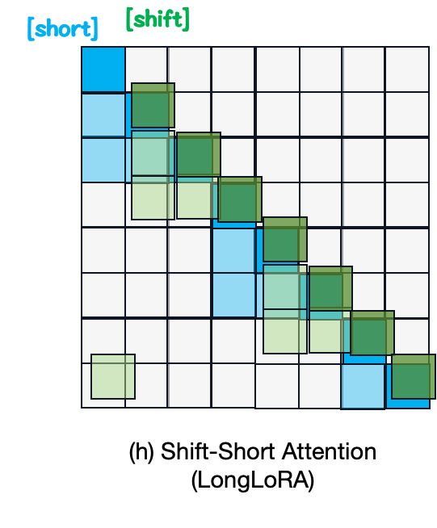
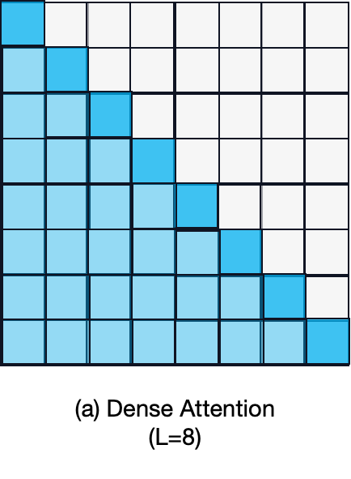
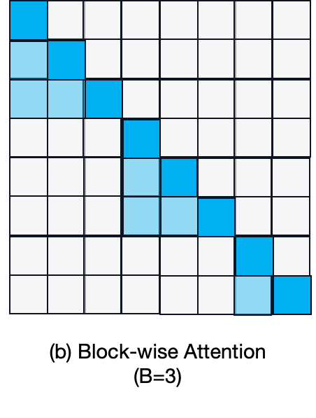
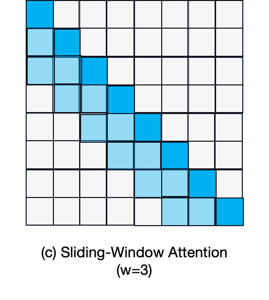
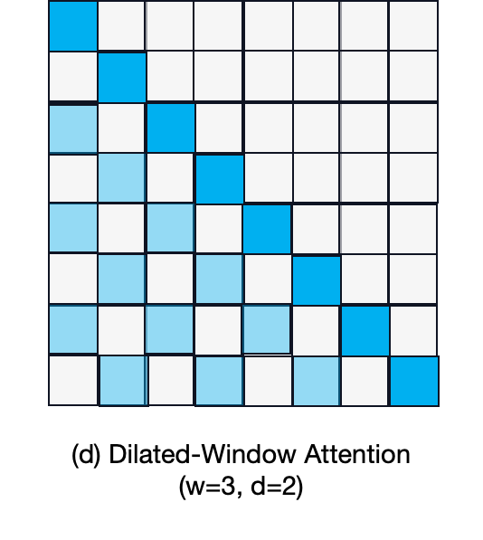
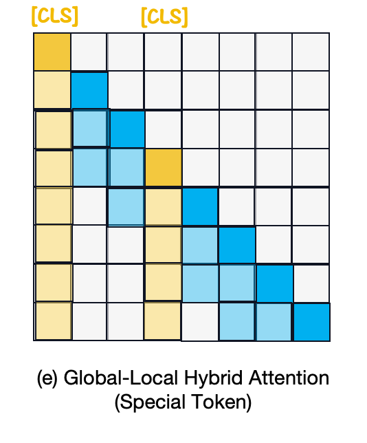
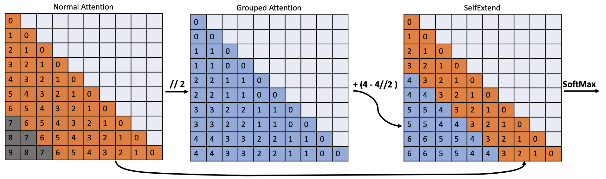
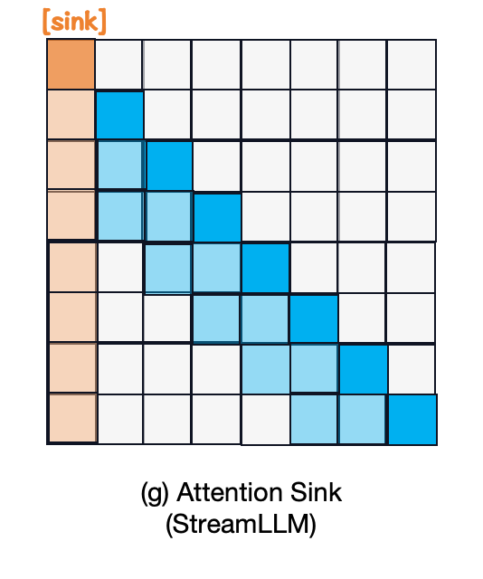
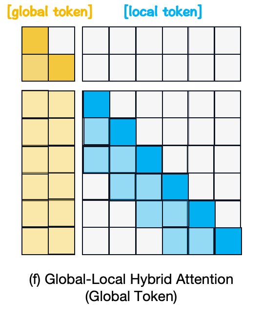

# Local Attention
*Here're some resources about Local Attention*


<p align="center">
  </img>
  <p align="center">
    <strong>Examples of Local Attention Patterns</strong>
  </p>
</p>
    

### Intro

The traditional attention mechanism is characterized by its global and full attention nature, wherein every token is expected to attend to every other token, resulting in quadratic time and space complexities. 

Considering the significance of local context in certain applications, various approaches have been introduced to implement local attention mechanisms in recent years. These mechanisms restrict each token’s attention to its neighboring tokens instead of all tokens, and the variations among these approaches arise from the heuristic criteria to determine who qualifies as a token’s neighbor, as depicted in the picture above.


### Table of Contents

* [Intro](#intro)
* [Block-wise Attention](#block-wise-attention)
* [Sliding Window Attention](#sliding-window-attention)
* [Global-Local Hybrid Attention](#global-local-hybird-attention)
* [LSH Attention](#lsh-attention)


### Block-wise Attention


#### LongLoRA: Efficient fine-tuning of long-context large language models [`READ`]

<p align="center">
  </img>
</p>

paper link: [here](https://arxiv.org/pdf/2309.12307.pdf)

citation: 
```bibtex
@article{chen2023longlora,
  title={Longlora: Efficient fine-tuning of long-context large language models},
  author={Chen, Yukang and Qian, Shengju and Tang, Haotian and Lai, Xin and Liu, Zhijian and Han, Song and Jia, Jiaya},
  journal={arXiv preprint arXiv:2309.12307},
  year={2023}
}
```
    


#### Landmark Attention: Random-Access Infinite Context Length for Transformers [`READ`]

paper link: [here](https://arxiv.org/pdf/2305.16300)

citation: 
```bibtex
@article{mohtashami2023landmark,
  title={Landmark Attention: Random-Access Infinite Context Length for Transformers},
  author={Mohtashami, Amirkeivan and Jaggi, Martin},
  journal={arXiv preprint arXiv:2305.16300},
  year={2023}
}
```
    


#### Efficient long sequence modeling via state space augmented transformer (SPADE) [`READ`]

paper link: [here](https://arxiv.org/pdf/2212.08136)

citation: 
```bibtex
@article{zuo2022efficient,
  title={Efficient long sequence modeling via state space augmented transformer},
  author={Zuo, Simiao and Liu, Xiaodong and Jiao, Jian and Charles, Denis and Manavoglu, Eren and Zhao, Tuo and Gao, Jianfeng},
  journal={arXiv preprint arXiv:2212.08136},
  year={2022}
}
```


#### Sparse sinkhorn attention [`READ`]

paper link: [here](http://proceedings.mlr.press/v119/tay20a/tay20a.pdf)

citation: 
```bibtex
@inproceedings{tay2020sparse,
  title={Sparse sinkhorn attention},
  author={Tay, Yi and Bahri, Dara and Yang, Liu and Metzler, Donald and Juan, Da-Cheng},
  booktitle={International Conference on Machine Learning},
  pages={9438--9447},
  year={2020},
  organization={PMLR}
}
```
    

#### Blockwise self-attention for long document understanding (BlockBERT) [`READ`]

<p align="center">
  </img>
  </img>
</p>

paper link: [here](https://arxiv.org/pdf/1911.02972)

citation: 
```bibtex
@article{qiu2019blockwise,
  title={Blockwise self-attention for long document understanding},
  author={Qiu, Jiezhong and Ma, Hao and Levy, Omer and Yih, Scott Wen-tau and Wang, Sinong and Tang, Jie},
  journal={arXiv preprint arXiv:1911.02972},
  year={2019}
}
```

#### Bi-directional block self-attention for fast and memory-efficient sequence modeling (Bi-BloSAN) [`READ`]

paper link: [here](https://arxiv.org/pdf/1804.00857)

citation: 
```bibtex
@article{shen2018bi,
  title={Bi-directional block self-attention for fast and memory-efficient sequence modeling},
  author={Shen, Tao and Zhou, Tianyi and Long, Guodong and Jiang, Jing and Zhang, Chengqi},
  journal={arXiv preprint arXiv:1804.00857},
  year={2018}
}
```

### Sliding Window Attention


#### Alternating Updates for Efficient Transformers [`READ`]

paper link: [here](https://arxiv.org/pdf/2301.13310.pdf)


```bibtex
@article{baykal2024alternating,
  title={Alternating updates for efficient transformers},
  author={Baykal, Cenk and Cutler, Dylan and Dikkala, Nishanth and Ghosh, Nikhil and Panigrahy, Rina and Wang, Xin},
  journal={Advances in Neural Information Processing Systems},
  volume={36},
  year={2024}
}
```


#### Funnel-transformer: Filtering out sequential redundancy for efficient language processing [`READ`]

paper link: [here](https://proceedings.neurips.cc/paper/2020/file/2cd2915e69546904e4e5d4a2ac9e1652-Paper.pdf)


```bibtex
@article{dai2020funnel,
  title={Funnel-transformer: Filtering out sequential redundancy for efficient language processing},
  author={Dai, Zihang and Lai, Guokun and Yang, Yiming and Le, Quoc},
  journal={Advances in neural information processing systems},
  volume={33},
  pages={4271--4282},
  year={2020}
}
```


#### Longformer: The long-document transformer [`READ`]

<p align="center">
  </img>
  </img>
  </img> 
</p>

paper link: [here](https://arxiv.org/pdf/2004.05150.pdf)

citation: 
```bibtex
@article{beltagy2020longformer,
  title={Longformer: The long-document transformer},
  author={Beltagy, Iz and Peters, Matthew E and Cohan, Arman},
  journal={arXiv preprint arXiv:2004.05150},
  year={2020}
}
```


### Global-Local Hybird Attention


#### LLM Maybe LongLM: Self-Extend LLM Context Window Without Tuning [`READ`]

<p align="center">
  </img>
</p>

paper link: [here](https://arxiv.org/pdf/2401.01325.pdf)

citation:
```bibtex
@misc{jin2024llm,
      title={LLM Maybe LongLM: Self-Extend LLM Context Window Without Tuning}, 
      author={Hongye Jin and Xiaotian Han and Jingfeng Yang and Zhimeng Jiang and Zirui Liu and Chia-Yuan Chang and Huiyuan Chen and Xia Hu},
      year={2024},
      eprint={2401.01325},
      archivePrefix={arXiv},
      primaryClass={cs.CL}
}
```

#### Lm-infinite: Simple on-the-fly length generalization for large language models [`READ`]

paper link: [here](https://arxiv.org/pdf/2308.16137)

citation: 
```bibtex
@article{han2023lm,
  title={Lm-infinite: Simple on-the-fly length generalization for large language models},
  author={Han, Chi and Wang, Qifan and Xiong, Wenhan and Chen, Yu and Ji, Heng and Wang, Sinong},
  journal={arXiv preprint arXiv:2308.16137},
  year={2023}
}
```
    


#### Efficient streaming language models with attention sinks [`READ`]

<p align="center">
  </img>
</p>

paper link: [here](https://arxiv.org/pdf/2309.17453)

citation: 
```bibtex
@article{xiao2023efficient,
  title={Efficient streaming language models with attention sinks},
  author={Xiao, Guangxuan and Tian, Yuandong and Chen, Beidi and Han, Song and Lewis, Mike},
  journal={arXiv preprint arXiv:2309.17453},
  year={2023}
}
```


#### LongT5: Efficient text-to-text transformer for long sequences [`READ`]

paper link: [here](https://arxiv.org/pdf/2112.07916)

citation: 
```bibtex
@article{guo2021longt5,
  title={LongT5: Efficient text-to-text transformer for long sequences},
  author={Guo, Mandy and Ainslie, Joshua and Uthus, David and Ontanon, Santiago and Ni, Jianmo and Sung, Yun-Hsuan and Yang, Yinfei},
  journal={arXiv preprint arXiv:2112.07916},
  year={2021}
}
```


#### ETC: Encoding long and structured inputs in transformers [`READ`]

<p align="center">
  </img>
</p>

paper link: [here](https://arxiv.org/pdf/2004.08483)

citation: 
```bibtex
@article{ainslie2020etc,
  title={ETC: Encoding long and structured inputs in transformers},
  author={Ainslie, Joshua and Ontanon, Santiago and Alberti, Chris and Cvicek, Vaclav and Fisher, Zachary and Pham, Philip and Ravula, Anirudh and Sanghai, Sumit and Wang, Qifan and Yang, Li},
  journal={arXiv preprint arXiv:2004.08483},
  year={2020}
}
```


### LSH Attention


#### Reformer: The efficient transformer [`READ`]

paper link: [here](https://arxiv.org/pdf/2001.04451)

citation: 
```bibtex
@article{kitaev2020reformer,
  title={Reformer: The efficient transformer},
  author={Kitaev, Nikita and Kaiser, {\L}ukasz and Levskaya, Anselm},
  journal={arXiv preprint arXiv:2001.04451},
  year={2020}
}
```
    