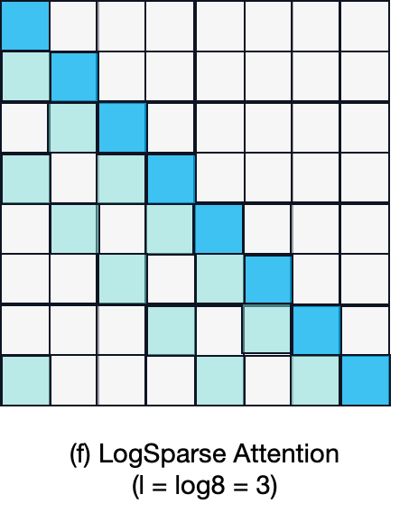
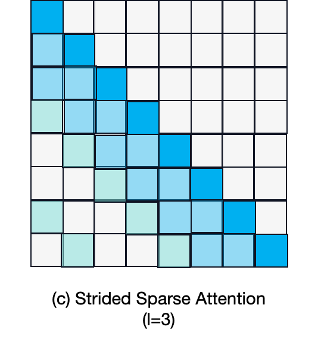
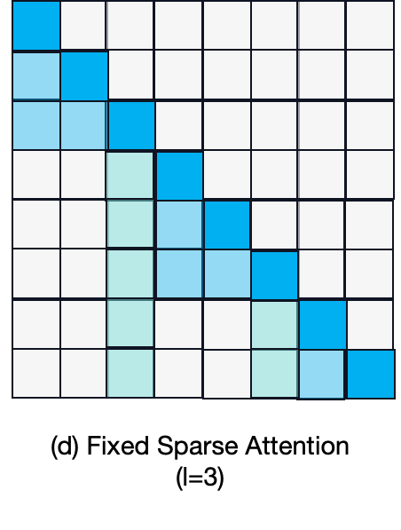
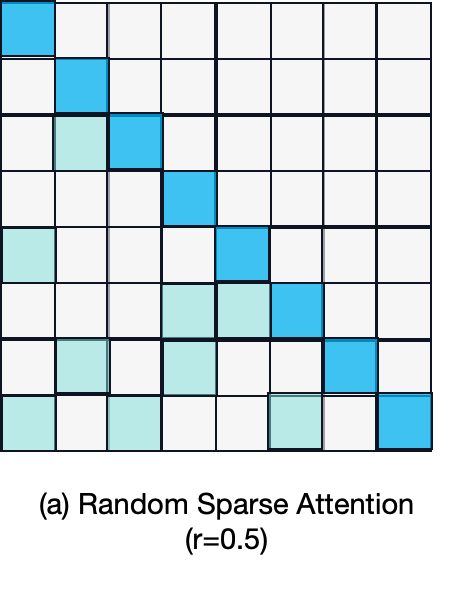
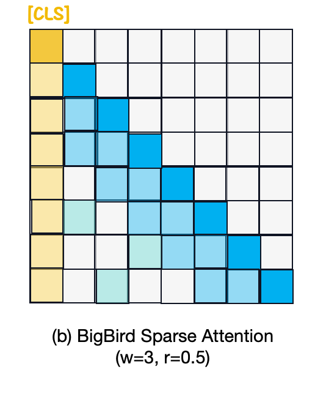
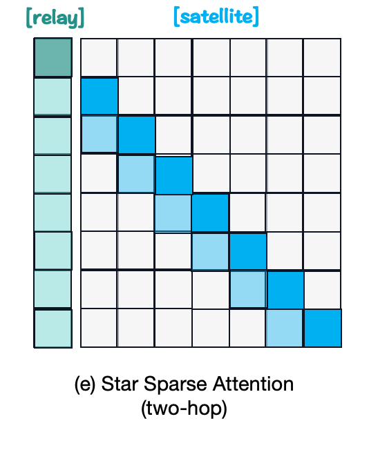

# Sparse Attention
*Here're some resources about Sparse Attention*

<p align="center">
  </img>
  <p align="center">
    <strong>Examples of Sparse Attention Patterns</strong>
  </p>
</p>


### Intro

While some approaches have introduced heuristics for achieving locality and hierarchical structure within self-attention, another direction explores the sparsity patterns inherent in full attention matrices. 

These methods aim to introduce a sparse attention mask, denoted as $M_{\mathcal{S}}$ , where each row i assigns a sparse set of indices $\mathcal{S}_i \subseteq \lbrace j|j < i \rbrace$ that the i-th token attends to. These sparsity-based attention mechanisms offer both computational efficiency and the ability to capture global context information. The figure above provides a visualization of these sparse attention mechanisms.


### Table of Contents
* [Intro](#intro)
* [Fixed Sparsity Patterns](#fixed-sparsity-patterns)
* [Adaptive Sparsity Patterns](#adaptive-sparsity-patterns)
* [Graph Sparsification](#graph-sparsification)


### Fixed Sparsity Patterns


#### Longnet: Scaling transformers to 1,000,000,000 tokens [`READ`]

paper link: [here](https://arxiv.org/pdf/2307.02486.pdf?trk=public_post_comment-text)

citation: 
```bibtex
@article{ding2023longnet,
  title={Longnet: Scaling transformers to 1,000,000,000 tokens},
  author={Ding, Jiayu and Ma, Shuming and Dong, Li and Zhang, Xingxing and Huang, Shaohan and Wang, Wenhui and Wei, Furu},
  journal={arXiv preprint arXiv:2307.02486},
  year={2023}
}
```

#### Enhancing the locality and breaking the memory bottleneck of transformer on time series forecasting (LogSparse) [`READ`]

<p align="center">
  </img>
</p>

paper link: [here](https://proceedings.neurips.cc/paper/2019/file/6775a0635c302542da2c32aa19d86be0-Paper.pdf)

citation: 
```bibtex
@article{li2019enhancing,
  title={Enhancing the locality and breaking the memory bottleneck of transformer on time series forecasting},
  author={Li, Shiyang and Jin, Xiaoyong and Xuan, Yao and Zhou, Xiyou and Chen, Wenhu and Wang, Yu-Xiang and Yan, Xifeng},
  journal={Advances in neural information processing systems},
  volume={32},
  year={2019}
}
```


#### Generating long sequences with sparse transformers [`READ`]

<p align="center">
  </img>
  </img>
</p>

paper link: [here](https://arxiv.org/pdf/1904.10509)

citation: 
```bibtex
@article{child2019generating,
  title={Generating long sequences with sparse transformers},
  author={Child, Rewon and Gray, Scott and Radford, Alec and Sutskever, Ilya},
  journal={arXiv preprint arXiv:1904.10509},
  year={2019}
}
```


### Adaptive Sparsity Patterns


#### Sparsebert: Rethinking the importance analysis in self-attention [`READ`]

paper link: [here](http://proceedings.mlr.press/v139/shi21a/shi21a.pdf)

citation: 
```bibtex
@inproceedings{shi2021sparsebert,
  title={Sparsebert: Rethinking the importance analysis in self-attention},
  author={Shi, Han and Gao, Jiahui and Ren, Xiaozhe and Xu, Hang and Liang, Xiaodan and Li, Zhenguo and Kwok, James Tin-Yau},
  booktitle={International Conference on Machine Learning},
  pages={9547--9557},
  year={2021},
  organization={PMLR}
}
```
    


#### Not all memories are created equal: Learning to forget by expiring (Expire-Span) [`READ`]

paper link: [here](http://proceedings.mlr.press/v139/sukhbaatar21a/sukhbaatar21a.pdf)

citation: 
```bibtex
@inproceedings{sukhbaatar2021not,
  title={Not all memories are created equal: Learning to forget by expiring},
  author={Sukhbaatar, Sainbayar and Ju, Da and Poff, Spencer and Roller, Stephen and Szlam, Arthur and Weston, Jason and Fan, Angela},
  booktitle={International Conference on Machine Learning},
  pages={9902--9912},
  year={2021},
  organization={PMLR}
}
```
    

#### Efficient content-based sparse attention with routing transformers [`READ`]

paper link: [here](https://direct.mit.edu/tacl/article-pdf/doi/10.1162/tacl_a_00353/1923932/tacl_a_00353.pdf)

citation: 
```bibtex
@article{roy2021efficient,
  title={Efficient content-based sparse attention with routing transformers},
  author={Roy, Aurko and Saffar, Mohammad and Vaswani, Ashish and Grangier, David},
  journal={Transactions of the Association for Computational Linguistics},
  volume={9},
  pages={53--68},
  year={2021},
  publisher={MIT Press One Rogers Street, Cambridge, MA 02142-1209, USA journals-info~…}
}
```


### Graph Sparsification


#### Big bird: Transformers for longer sequences [`READ`]

<p align="center">
  </img>
  </img>
</p>

paper link: [here](https://proceedings.neurips.cc/paper/2020/file/c8512d142a2d849725f31a9a7a361ab9-Paper.pdf)

citation: 
```bibtex
@article{zaheer2020big,
  title={Big bird: Transformers for longer sequences},
  author={Zaheer, Manzil and Guruganesh, Guru and Dubey, Kumar Avinava and Ainslie, Joshua and Alberti, Chris and Ontanon, Santiago and Pham, Philip and Ravula, Anirudh and Wang, Qifan and Yang, Li and others},
  journal={Advances in neural information processing systems},
  volume={33},
  pages={17283--17297},
  year={2020}
}
```
    

#### Star-transformer [`READ`]

<p align="center">
  </img>
</p>

paper link: [here](https://arxiv.org/pdf/1902.09113)

citation: 
```bibtex
@article{guo2019star,
  title={Star-transformer},
  author={Guo, Qipeng and Qiu, Xipeng and Liu, Pengfei and Shao, Yunfan and Xue, Xiangyang and Zhang, Zheng},
  journal={arXiv preprint arXiv:1902.09113},
  year={2019}
}
```
    