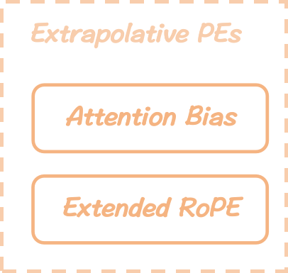

# Extrapolative PEs
*Here're some resources about Extrapolative PEs*

<p align="center">
    </img>
    <p align="center">
        <strong>Taxonomy of Extrapolative PEs</strong>
    </p>
</p>


### Intro

Positional Embeddings (PEs) are minute but essential in the Transformer, especially for NLP tasks.  Unfortunately, recent studies have highlighted a significant shortcoming of *length extrapolation* or *length generalization* ability (training the model on short sequences but can be well-performed on longer ones during inference) for Transformer-based language models. One of the reasons have been discovered in recent few years that the current wildly-used design for PEs are not extraploative. Recognizing the need to push the inference length boundary beyond $L_{max}$, the research community has made significant efforts in this direction recently.

Notably, according to [this](#exploring-length-generalization-in-large-language-models-read) recent work, they have determined that *distractors* are the primary cause of failures in length generalization in the case of *parity* task. These issues, however, can be mitigated considerably through approaches such as *scratchpad prompting*. Nevertheless, in this section, our focus remains on the undeniable role that current PEs play in length generalization in more general scenarios.


### Table of Contents
* [Intro](#intro)
* [Preliminaries](#preliminaries)
* [Enhancing Understanding](#enhancing-understanding)
* [Attention Bias](./extrapolative_pes_sec/attention_bias.md)
* [Extended RoPE](./extrapolative_pes_sec/extended_rope.md)
* [References](#references)
      


### Preliminaries

* **Positional Embeddings (PEs)**. Unlike recurrent neural networks(RNNs), Transformers process input tokens in parallel as a bag-of-words and lack an inherent sense of sequence order. To preserve the sequential information, the vanilla Transformer presents a novel Sinusoidal PE (SinPE). As depicted in the equation below, every entry in each dimension of SinPEs is derived based on trigonometric functions like $sin$, $cos$, and the periods vary exponentially with respect to absolute token positions, where base is a large integer manually set to 10000 according to the original paper without further explanation, and $d$ is the unit embedding dimension of hidden states. 

$$
\begin{align}
&\mathrm{SinPE}(n) := 
    \left[\begin{matrix}
        sin(n\theta^0) \\
        cos(n\theta^0) \\
        sin(n\theta^1) \\
        cos(n\theta^1) \\
        \vdots\\
        sin(n\theta^{\frac{d}{2}-1})\\
        cos(n\theta^{\frac{d}{2}-1})\\
\end{matrix}\right], 
\quad where\quad \theta = base^{-\frac{2}{d}}, \quad n\in\lbrace 0,1,\cdots, L-1 \rbrace 
\end{align}
$$

  Some variants have recently emerged, including trainable embeddings to learn an embedding mapping and relative embeddings based on relative positions. Among them, Rotary PE ([RoPE](#roformer-enhanced-transformer-with-rotary-position-embedding-read)) applies a rotation operation on a complex field (see the equation below) instead of an addition to $Q, K$ based on absolute positions, where it shares the same basis function as SinPE.

$$
\begin{align}
&\widetilde{\mathbf{q_i}}, \widetilde{\mathbf{k_j}} := f(\mathbf{q},i), f(\mathbf{k},j),\quad where\quad f(\mathbf{x},n) := \mathbf{x} e^{in\theta} = \mathrm{RoPE}(n)\times\mathbf{q},\\
& \mathrm{RoPE}(n) := \left[\begin{matrix}
        R_n^{(0)}\\
        \quad & R_n^{(1)}\\
        \quad & \quad & \ddots\\
        \quad & \quad & \quad & R_n^{(\frac{d}{2}-1)}\\
    \end{matrix}\right],\quad R_n^{(i)}:=\left[\begin{matrix}
        cos(n\theta^i) & -sin(n\theta^i)\\
        sin(n\theta^i) & cos(n\theta^i)\\
    \end{matrix}\right]
\end{align}
$$
  
  According to the property described in the following equation, not only RoPEs ensure the magnitude of $\mathbf{q}, \mathbf{k}$ remains unchanged due to unitary transformation, but also every entry in $P$, i.e., each pair of $\mathbf{q}, \mathbf{k}$, will only be tagged with embeddings in terms of their relative distance in the sequence. RoPE provides a more stable scheme to handle longer sequences. It captures relative positional patterns with absolute position awareness, thus widely used in state-of-the-art open-source LLMs like LLaMA and GLM. It is worth noting that SinPEs are initially applied on the word embeddings before entering the Encoder or Decoder blocks by addition. Comparing the [vanilla structure](../imgs/vanilla_Transformer_sinpe_highlight.png) with the current typical one in [Fig](../imgs/overview_with_caption.png) $\mathbf{(a)}$, RoPEs are applied to $Q, K$ in each attention layer before the kernel operations by equivalent element-wise vector multiplication to save registered buffer memory.
  
$$
\begin{align}
||R_i\mathbf q|| = ||\mathbf q||,\quad P_{i,j} := \langle R_i\mathbf q, R_j\mathbf k\rangle = \mathbf q^{\mathrm{T}}R_i^{\mathrm{T}}R_j\mathbf k = \mathbf q^{\mathrm{T}} R_{j-i} \mathbf k
\end{align}
$$


* **Max-Length Constraint:** During the training phase, engineers typically need to determine a crucial hyper-parameter *max-length*, denoted as $L_{max}$. This hyperparameter represents the upper bound on sequence length for any training sample in a batch. It is commonly set to values such as 1k, 2k, or 4k based on the available computational resources to avoid Out-of-Memory (OOM) errors on GPUs. However, during inference, LLMs service providers must also either restrict the length of user prompts or automatically truncate them to align with the predefined $L_{max}$, even though inference resources are typically more abundant than during training. Note that none of the Transformer modules inherently require such restrictions since all learned weights depend solely on dimension sizes. So, theoretically, Transformers can process sequences of any length as long as the resources are sufficient. Unfortunately, current Language Models have shown noticeable performance degradation when handling input sequences exceeding $L_{max}$, often resulting in repetitive and implausible outputs.


### Enhancing Understanding

* **Rethinking PEs as $\beta$-Encoding**. Su revisits the sine and cosine basis functions of SinPE and RoPE in his [blog](#transformer-upgrade-roadmap-10-rope-is-a-beta-base-encoding-read), considering them as approximated terms for the $\beta$-encoding system to represent any position number $n$, as shown in the equation below. This approach employs $\frac{d}{2}$ fixed $\beta$-bits, where $\beta := \theta^{-1} = base^{2/d}$ represents the power basis of the wavelength or period of the trigonometric basis functions, which increases as a geometric series $\lbrace \beta^i \rbrace_{i=0}^{d/2}$ with the dimension $i$ goes deeper.

$$
\begin{align}
    & n(\beta) := \lbrace\lfloor \cfrac{n}{\beta^{i}} \rfloor \space\mathrm{mod}\space \beta \rbrace_{i=0}^{\lceil \log_{\beta} n \rceil-1}
\end{align}
$$

  To gain a deeper understanding of this concept, we can draw a comparison between the equation above and the format of SinPE, RoPE. It becomes evident that  the $i$-th $\beta$-bit of the representation of $n$ involves the division of the $i$-th power of $\beta$, followed by some sort of periodical operations ($mod$ in $\beta$-encoding and $sin,cos$ in SinPE, RoPE).

* **Length Extrapolation Dilemma** Prior to the era of Transformers, RNN-based language models were trained on shorter sequences but were expected to generalize effectively to longer contexts, a phenomenon referred to as *length extrapolation* or *length generalization*. Unfortunately, recent studies have highlighted a significant shortcoming of *length extrapolation* ability for Transformer-based language models. This causes the insufficient context length limit during inference when applying to real-world applications.

  In the original Transformer paper, there is few discussion regarding the design insights or theoretical interpretation of their SinPE. This has led many researchers to question its necessity and effectiveness, especially the blame on the extrapolation deficit, which points to the same trigonometry-based RoPE as well. To understand the bad extrapolation caused by current trigonometric PEs, we investigate and summarize two insights from distint views as below:
  * From a mathematical view, as Su explains in his [blog](#transformer-upgrade-roadmap-7-length-extrapolation-and-local-attention-read), extrapolation, which involves inferring the whole from local information, depends on the high-order **smoothness** of the function. However, to accommodate sufficient positional information, these PEs are designed as combinations of high-frequency oscillatory trigonometric basis functions. This choice makes it challenging for the models to generalize without specific learning during training stages. 
  * From a training view, due to the wavelength or period of the basis functions increases exponentially, proportional to $\lbrace \beta^i \rbrace_{i=0}^{d/2}$, training samples constrained by currently supported $L_{max}$ are typically too short for the rear low-frequency dimensions to  span the entire periodic cycle. This suggests only a few dimensions perceive complete periodic information thus receiving sufficient training for extrapolation, and the boundary is defined as **critical dimension** (e.g. for Llama2-4k, the critical dimension is only 92). Consequently, direct extrapolation becomes prone to failure when relying on these poor-learned low-frequency components.


### References


#### Transformer Upgrade Roadmap: 10. RoPE is a beta-base Encoding [`READ`]

blog link: [here](https://spaces.ac.cn/archives/9675)

citation: 
```bibtex
@misc{transformer-upgrade-10,
    author = "Su, Jianlin",
    title = "Transformer Upgrade Roadmap: 10. RoPE is a beta-base Encoding",
    year = "2023",
    month = "Jul",
    howpublished = "\url{https://spaces.ac.cn/archives/9675}"
}
```


#### Transformer Upgrade Roadmap: 7. Length Extrapolation and Local Attention [`READ`]

blog link: [here](https://spaces.ac.cn/archives/9431)

citation: 
```bibtex
@misc{transformer-upgrade-7,
    author = "Su, Jianlin",
    title = "Transformer Upgrade Roadmap: 7. Length Extrapolation and Local Attention",
    year = "2023",
    month = "Jan",
    howpublished = "\url{https://spaces.ac.cn/archives/9431}"
}
```


#### Exploring length generalization in large language models [`READ`]

paper link: [here](https://proceedings.neurips.cc/paper_files/paper/2022/file/fb7451e43f9c1c35b774bcfad7a5714b-Paper-Conference.pdf)

citation: 
```bibtex
@article{anil2022exploring,
  title={Exploring length generalization in large language models},
  author={Anil, Cem and Wu, Yuhuai and Andreassen, Anders and Lewkowycz, Aitor and Misra, Vedant and Ramasesh, Vinay and Slone, Ambrose and Gur-Ari, Guy and Dyer, Ethan and Neyshabur, Behnam},
  journal={Advances in Neural Information Processing Systems},
  volume={35},
  pages={38546--38556},
  year={2022}
}s
```

#### Roformer: Enhanced transformer with rotary position embedding [`READ`]

paper link: [here](https://arxiv.org/pdf/2104.09864)

citation: 
```bibtex
@article{su2021roformer,
  title={Roformer: Enhanced transformer with rotary position embedding},
  author={Su, Jianlin and Lu, Yu and Pan, Shengfeng and Murtadha, Ahmed and Wen, Bo and Liu, Yunfeng},
  journal={arXiv preprint arXiv:2104.09864},
  year={2021}
}
```
    
