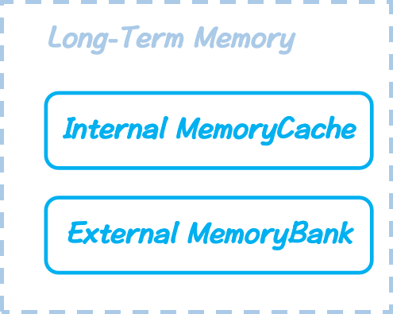

# Long-Term Memory
*Here're some resources about Long-Term Memory*

    </img>
    

        <strong>Taxonomy of Long-Term Memory</strong>
    

### Intro

Transformer architectures often struggle with capturing long-term dependencies due to in-context working memory. Researchers have explored two main avenues to address this challenge without compromising the advantages of full attention. 

First, inspired by RNNs, some have introduced recurrent mechanisms into attention by incorporating **internal memory caches** accessible through attention layers. This approach enables the model to maintain and retrieve information over longer sequences, compensating for the inherent lack of built-in long-term memory.

Second, an alternative approach involves leveraging existing models as interfaces to **external knowledge bases**, such as specific documents or datasets During inference, the model can read from these knowledge bases to enrich its contextual input and write to them from the user’s response to refresh its long-term memory. By integrating external knowledge in this manner, the model gains access to a broader range of context, enhancing its ability to handle long-term dependencies effectively.

### Table of Contents
* [Intro](#intro)
* [Preiliminaries](#preliminaries)
* [Internal MemoryCache](./long-term_memory_sec/internal_memory_cache.md)
* [External MemoryBank](./long-term_memory_sec/external_memory_bank.md)

### Preliminaries

* **Key-Value Cache:** In a **narrow sense**, the Key-Value (KV) cache is a list of tensors that stores the k, v embeddings for all previous tokens in the attention layer for each block, utilized and updated during the autoregressive generation process of causal LLMs. 
  
  As shown in [Overview](../imgs/overview_with_caption.png) $\mathbf{(a)}$, before the first token is generated, all KV caches are initialized empty and will be filled with $L$ (key, value) pairs after the heave attention computation with $L$ queries and $L$ keys. Then, the first generated token will also be considered as input, extending the whole sequence to $L+1$ tokens. To avoid redundant calculations, the real input will contain only the latest generated token, deriving one new triplet of (query, key, value). But to compute equivalently, the new query has to attend and apply to all $L+1$ previous keys and values, thus the new (key, value) have to concatenate with past L pairs stored in the KV cache, and update themselves into it for the next generated token to attend. 
  
  However, in a **broad sense**, we can consider the KV cache as the memory storage of LLMs, whose occupation grows linearly as the generated tokens increase. That directly causes one of the limitations below about the lack of efficient memory and suggests the approaches to enhance the long-term memory mechanisms for LLMs.

* **In-context Memory**. LLMs lack an explicit memory mechanism, relying solely on the KV cache to store representations of all previous tokens in a list. This design implies that once querying is completed in one call, the Transformer does not retain or recall any previous states or sequences in subsequent calls unless the entire history is reloaded token by token into the KV cache. Consequently, the Transformer possesses only an in-context working memory during each call, as opposed to an inherent memory mechanism such as Long Short-Term Memory (LSTM). This statelessness offers computational advantages in terms of parallelism but presents challenges in tasks like chatbot applications, where long-term memory retention is essential.